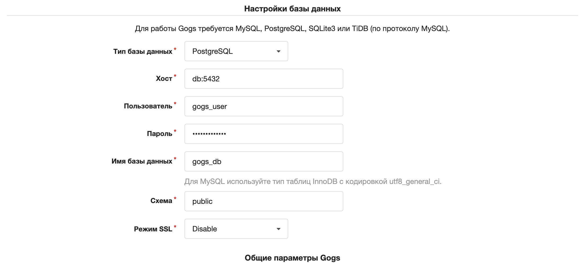

# GOGS через docker-compose

### Запуск локальной системы контроля версий в docker-контейнере

---

### Процесс запуска
1. Установите [Docker](https://www.docker.com/)
2. Склонируйте этот репозиторий
3. Создайте файл ```.env``` со следующим содержимым:
```shell
    PG_DATABASE=gogs_db
    PG_USER=gogs_user
    PG_PASSWORD=gogs_password
```
Значения переменных при необходимости можно изменить

4. Запустите контейнер командой ```docker compose up -d```
5. Сервер gogs будет доступен по адресу [http://localhost:3000](http://localhost:3000)
6. При первом запуске введите указанные в файле ```.env``` данные в нужные поля для подключения к базе данных. Адрес сервера базы необходимо указать как ```db:5432```, как на примере ниже:
   
7. Пройдите регистрацию. Первый созданный пользователь будет обладать правами администратора сервера.
